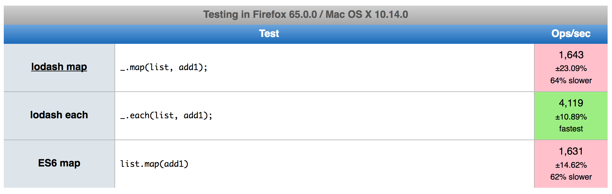

# `_.map()` vs `[].map()`
It is a resource comparation between `map by @lodash` and `map by ES6` and `each by @lodash`, by headling an json with 10,000 data

## Generating json file with 30,000 objects array
```
$ node gen
```

## Run test
```
$ node vs
```

### Result:
```
name           for.js    _.map.js  _.each.js
-------------  --------  --------  ---------
diffRAM        8 MB      8 MB      6 MB
diffHeapTotal  8 MB      5 MB      5 MB
diffHeapUsed   5 MB      4 MB      2 MB
diffExternal   17 Bytes  88 KB     24 KB
diffCPU        30.561    46.163    23.739
diffTime       30        44        22
```

## Remark 
`_.each.js` uses tiny bit less resource

Performance test: [JSPERF](https://jsperf.com/es6-vs-lodash/1)

